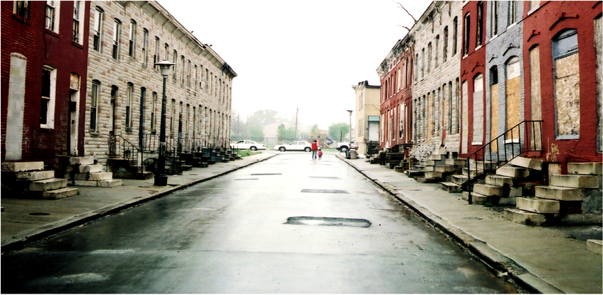
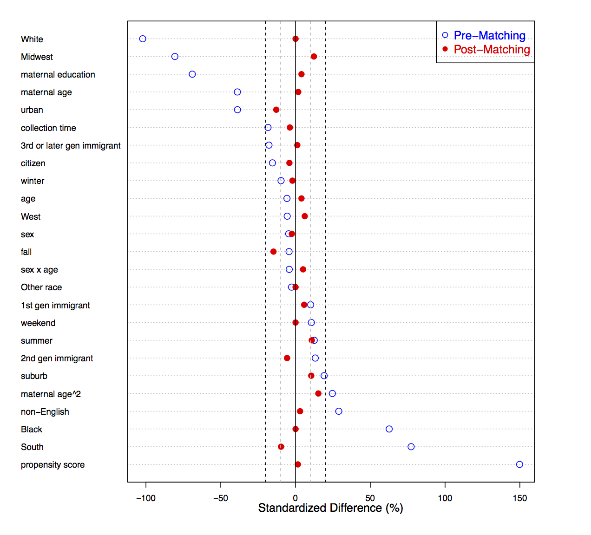

# Neighborhood Disadvantage and Cortisol
 
 
 
 
### Kara Rudolph, PhD, MHS, MPH
krudolph@jhsph.edu

Note: thank you, for that kind introduction and 
thanks to you all for coming today. 
my name is kara rudolph ;
i'm currently a postdoc at Johns Hopkins and i'm going to be talking about some work that was just published on the relationship between neighborhood disadvantage and cortisol in adolescents. 
in particular, i'm going to be focusing on the challenges we encountered in trying to use cortisol data from from a large, nationally represtentative sample and how we sought to address those challenges.

---

## Motivation

 

<small> National Comorbidity Survey Replication Adolescent Supplment (NCS-A). Merikangas et al., 2010 </small>

Note: My research so far has been motivated by the goal of working to improve the MH of teens in disadvantaged neighborhoods. This graph is from a US nationally representative ...dataset that I used for this work. IT shows the cumulative prevelance of different categories of disorders by age. We see that poor mental health is a major public health issue. For example, nearly 12% of adolescents had ever had major depressive disorder and nearly 32% ever had an  anxiety disorder....

---

## Motivation
  
Missed school and sociodevelopmental opportunities $\rightarrow$ 
 

* Education
* Employment
* Earnings
* Family life

Note: These disorders are not typically isolated, time-limited events, but can have consequence that extend over the lifecourse
For example, they cause children and adolescents to Miss school and sociodevelopmental opportunities $\rightarrow$ which studies have shown negatively affects educational achievement (Breslau et al., 2008), 
future employment (Kessler et al., 2006), 
earnings (Kessler et al., 2008), 
family life (Kessler et al., 1998)

---

## Motivation
 

* Depression: 500 million disability days/year, cost of 36B
* Anxiety: 700 million disability days/year
* WHO disease burden rankings

Note: MHdisorders in childhood also Increase risk of disorders in adulthood 
discorders in adulthood have been shown to have signiifcant $\rightarrow$ economic costs
[read]
in fact, depression and anxiety are the leading contributors to years lost to disability in the WHO disease burden rankings

---

## Motivation: Importance of Place

Note: So, it's clear that MH is imporatnat, but why neighborhood? 
well, intuitively, we understand that living in a neighborhood in Kensington may be a different experience than living in a neihgborhood in Rittenhouse Sq. 
For example, i taught creative writing to a class of public HS students in DC for a year. theyhad to deal wiht violence on a fairly regular basi-- one of their classmates was tragically even shot and killed. its hard to imagine a classroom of kids from one of the surrounding wealthy suburbs having a similar experience. 

---

## Motivation: Importance of Place

Note:
so living in a disadvantaged neighborhood is thought to entail exposure to more sources stress--e.g., violence, lack of opportunity for work and for education, low-collective efficacy--that act to dysregulate the stress response system within individuals. 
dysregulation of the stress response system has been linked to depression and anxiety disorders

---

## Salivary Cortisol
 

* Easy to sample
* Free, unbound
* Indicator of HPA axis

Note: 
Cortisol is one component of the stress response system. It is frequently used in research studies as a proxy for the stress response system and for good reason. 

1. easy to sample -- doesn't provoke stress -- good, because trying to figure out the effects of sources of stress external to the stress measurement itself!
2. salivary cortisol contains free, unbound cortisol, which is the only component of cortisol to reach the target tissue and elicit any effects. 
3. indicator of Hypothalamic pituitary adrenal axis, which is a major player in the stress response system. and is particuarly relevant to thinking about neighborhood sources of stress, because it is sensitive to psychosocial sources of stress. e.g., low locus of control, maternal neglect
and because it has been implicated in depressive and anxiety disorders

---

## Research Question
 
To what extent does living in a disadvantaged neighborhood influence cortisol levels among adolescents?
 
 

<small>Rudolph KE, Wand GS, Stuart EA, Glass TA, Marques AH, Duncko R, Merikangas KR. The association between cortisol characteristics and neighborhood disadvantage in a population-based sample of U.S. adolescents. <i>Health Place</i>. 2014; 25: 68-77.</small>

Note: So now to bring it back to the study at hand, our goal was to see to what extent does living in a disadvantaged neighborhood influence cortisol levels among adolescents?

---

## Gaps
 

* Few studies
* Small sample size
* Racial/ethnic homogeneity
* Geographic homogeneity

Note: In Examining the association between ND and cortisol, we were motivated by several gaps in the literature. 

1. First, there has been surprisingly little research into this realtionship in adolescets. In fact, in my literature review, I only found 3 studies. 
2.  However, each of thes 3 studies were Limited by small sample size and racial/ethnic and geographic homogeneity.
for example the biggest study only included 163 teens (163, 100, 79)
2/3 studiies were only of african americans
and all 3 of the studies only sampled from single urban areas (flint, St Louis, Philadelphia)

---

## NCS-A
 

* Largest sample to date (2,490 have cortisol measurements).
* Racially and ethnically diverse. 
* Participants drawn from different regions of the U.S., urbanicities. 

Note:  the dataset that we had was well-suited to address these gaps. The dataset is the NCSA--or national comorbidity survey adolescent supplement. actually wellAgain, I thought the NCS-A was well-suited to address these gaps.
[read]

Nationally representative, cross-sectional sample of U.S. adolescents 13-17 years old, 
* so racially and ethnically diverse
* and [read]

---

## NCS-A
 

* Sources of information relevant to this study:
  * Face-to-face, computer-assisted interviews with the adolescent. 
  * Saliva collected before and after each interview.
  * Self-administered questionnaire to parents or parent surrogate of the adolescent.
  * Geocoded residence.

Note: 
The NCS-A collects information from a variety of sources, but i'll just go through the sources that are relevant to this study.

Now, although we felt we were well positioned to address some gaps, we still had some major challenges to overcome, so I'm going to spend some time talking about the challenges we faced and how we went about addressing them. 

---

## Broad Challenges
 

* Confounding (neighborhood assignment not random)

Note: 
First, there are a few broad challenges that arise with most neighborhood work.

One is [read]
This means that there could be many factors that could influence where people live and also influence their cortisol levels. We worry about this, because it may result it in appearing as though there is an association betwen neighborhood and cortisol when there actually isn't.  One example may be race. Racial segregation of neighbrohood has roots in historical practices, like redlining, and persists today. So race may influence neighborhood and there is also some evidence that cortisol may differ by race.

---

## Broad Challenges
 

* Confounding (neighborhood assignment not random)
* Positivity violations (economic and racial segregation of neighborhoods)

Note: 
2. positivity violations represent another methodologic challenge. Pos viols means that for a particular set of covariate values, assignment of neighborhood is completely defined--there is no randonmess. I'll get into this more later, but one example of where this can come about in neihgborhood research is due to the economic and racial segregation of neihgborhoods in this country. For example... 

---

## Confounding
 

* Propensity score methods

 
Propensity score = $P(A=1 | \mathbf{W})$

Note: 
One way that we addressed both confounding and positivity is through propensity socre methods. 
PS is the probability of treatment assignment con- ditional on a vector of observed variables. what it means in this case. how it is measured.
Type of balancing score because theory says [assuming some things] that exact matching on propensity score (so for example, matching kids who live in nondisadvantaged neighborhoods and with kids who living in disadvantaged enighrborhoods and who have the same PS) ensures that the treatment groups being compared are balanced across a vector of covariates. That means, no more confounding. 
In practice, we can't exact match, and that's okay. matching on PS that are close to each other has been shown to greatly reduce bias.

---

## Confounding

Note:
showing how well it worked in terms of balancing distribution of covariates across tx groups. describe figure

---

## Confounding
 

* Propensity score methods
* Outcome regression

Note:
But our PS model could be wrong, right? To reduce dependence on this model, weThen, we ran the regular regression analyses we would have run had we not done matching on our matched datasets. This approach can be thought of as double robust, because xxx

---

## Confounding
 

* Propensity score methods
* Outcome regression
* Sensitivity analysis for an unobserved confounder

Note:
Now, maybe our tx or outcome model is correct for the covariates we observe, but what about for those covariates that we don't observe? BEcause neighborhood is not randomly assigned, there could still be imbalances in variables we don't observe that could act as confounders for the ND-cortisol relationship. To deal with this we did sensitivity analyses for unobserved confounding, which I'll show near the end if there is time.

---

## Positivity Violations

Note:
Recall that another one of our broad challenges are positivity violations. That means that some folks in disadv neighborhoods have essentially a zero probability of living in a nondis neighborhood and vise versa. This is a problem, becasue we don't have anyone similar to compare these folks to. 
by excluding those without similar counterparts, we are essentially chopping off the tails. s
such that for a given propensity score, there are participants in both categories of neihgborhood. meaning that for a given propensity socre, there is some randomness in neighborhood assingment.

---

## Broad Challenges
 

* Confounding (neighborhood assignment not random)
* Positivity violations (economic and racial segregation of neighborhoods)
* Lack of generalizability 

Note: 
A 3rd challenge is a Lack of generalizability. means that results estimated in some study samples may not be valid for other samples or target populations. I'm going to leave this alone for now, but come back to it later.

---

## Cortisol Challenges

Note:
So, now I've talked about how we addressed some broad challenges related to our neighborhood, but we also had challenges related to cortisol. the stress response system is extremely complex, and so Examining the relationship between neighborhood sources of stress and cortisol involves requires stratgies to manage this complexity. given this complexity, cortisol is ideally measured under very strict laboratory protocols, but this isn't practical in a large, nationally representative sample like the NCSA
we were left with the challenge: How to construct a controlled analysis?

---

## Cortisol Challenges
 

Challenge | Approach
--------- | --------
Not at-risk for a cortisol response | Restrictive exclusion criteria

Note:
some kids may not be at risk for cortisol being influenced by environmental sources of stress. for example, those kids whose cortisol levels are artificially influenced by things like steroid inhalers for asthma, birth control, smoking, drugs etc. 
so we applied very restrictive exclusion criteria

---

## Cortisol Challenges
 

Challenge | Approach
--------- | --------
Not at-risk for a cortisol response | Restrictive exclusion criteria
Blunting | Sensitivity analysis

Note:
Seoncd, the relationship between ND and cortisol also likely depense on the History of exposure to stress. With moderate amounts of stress, resting cortisol levels increase and reactivity also increases. But among those who have been exposed to really severe and persistant stress---children who are abused---the cortisol levels and reactivity actually are blunted---look more similar to unstressed children.This is called blunting, because the idea is that after repeated or prolonged activation of the stress response system, this response wears out. Including kids who experience severe, persistent stress could result in a possible washout effect. so we did a sensitivity analysis where we excluded these kids. 

---

## Cortisol Challenges
 

Challenge | Approach
--------- | --------
Not at-risk for a cortisol response | Restrictive exclusion criteria
Blunting | Sensitivity analysis
Heterogeneity by CAR/ post-CAR | Restricted to post-CAR

 
<small>(Do et al., 2011.)</small>

Note:
time of day. Graph: diurnal rhythm. explain CAR.

and the relationship between enighborhood sources of stress may differ depending on time of day. explain graph 

---

## Cortisol Challenges
 

Challenge | Approach
--------- | --------
Not at-risk for a cortisol response | Restrictive exclusion criteria
Blunting | Sensitivity analysis
Heterogeneity by CAR/ post-CAR | Restricted to post-CAR
Diurnal rhythm | Propensity score matching with Mahalanobis matching 
Other strong predictors | Propensity score matching with exact matching

Note:
strong predictors like sample time, school day versus nonschool day, race/ethnciicy combined ps matching with matching on the subset of these especially important predictors. explain.

---

## Results
 

Cortisol Outcomes

* Pre-interview
* Post-interview
* Slope over the course of the interview

Note: 
So now, at long last, I'm going to talk about our results. There were 3 cortisol outcomes that we examined in this analysis. [read the 3] These don't correspond to specific HPA axis dimensions, since cortisol wasn't measured under controlled conditions with standardized protocols, so I'm going to take a second to describe what these outcomes may reflect. 

Pre invterview levels likely reflect any activity the adolescent was engaged in prior to the interview, foods, as well as anticipation of the new situation of being interviewred in her home by a researcher for ta survey on mental health. Something out of the ordinary! And relevant, because the HPA access is particularly sensitive to novelty.

The interview was specifically designed not to be stressful, so adoelscents probably became pretty bored over the course of the interview. The post-interview levels may relfect that as well as the fact that now the adolescent has been sitting down for 2 and a half hours. 

We also looked at slope over the course of the interview-- post - pre/ interview time. this can be thought of as a measure of recovery from this novel interview situation.

---

## Results
 

Conditional expected ratios of cortisol levels (left) and   conditional expected differences in cortisol slope (right)   comparing those in disadvantaged versus non-disadvantaged neighborhoods. 

---

## Results
 
Conditional expected ratios of cortisol levels (left) and   conditional expected differences in cortisol slope (right)   comparing those in disadvantaged versus non-disadvantaged neighborhoods.

Note: Left panel showing conditional expected ratios of cortisol levels comparing adolescents in disadvantaged neighborhoods to those in non-disadvatnaged neighborhoods. Point estimates and 95% CI

---

## Results
 
Conditional expected ratios of cortisol levels (left) and   conditional expected differences in cortisol slope (right)   comparing those in disadvantaged versus non-disadvantaged neighborhoods. 

Note:
Top panel is for the pre-interview cortisol levels and 

---

## Results
 
Conditional expected ratios of cortisol levels (left) and   conditional expected differences in cortisol slope (right)   comparing those in disadvantaged versus non-disadvantaged neighborhoods. 

Note:and bottom Panel is for the post-interview cortisol levels.

---

## Results
 
Conditional expected ratios of cortisol levels (left) and   conditional expected differences in cortisol slope (right)   comparing those in disadvantaged versus non-disadvantaged neighborhoods. 

Note:
Right shows the conditional expected diffrences in cortisol slope  comparing adolescents living in disadvantaged versus non-disadvantaged neighborhoods.
Again, we show the estimate and 95% CI

---

## Results
 
Conditional expected ratios of cortisol levels (left) and   conditional expected differences in cortisol slope (right)   comparing those in disadvantaged versus non-disadvantaged neighborhoods. 

Note: In each of the three panels, we show the results for the unadjusted and 3 adjusted models. 
Adjusted Mdoel 1 adjusted for possible confounders listed in the previous figure in both propesntiy score matching and regression. BEcause of the definition of confounder, these were variables that we thought would not be affected by the exposure. So for example, gender, age, race, season, region of the country, immigrant status, etc. 

---

## Results
 
Conditional expected ratios of cortisol levels (left) and   conditional expected differences in cortisol slope (right)   comparing those in disadvantaged versus non-disadvantaged neighborhoods. 

Note: Adjusted model 2 added variables for which there could be debate about whether they could be affected by the exposure. So, they could be confounders and mediators. These were family income and employment history and current status.

---

## Results
 
Conditional expected ratios of cortisol levels (left) and   conditional expected differences in cortisol slope (right)   comparing those in disadvantaged versus non-disadvantaged neighborhoods. 

Note: Adjusted model 3 added hypothesized mediators: small for gestational age, BMI, and sleep variables like typical bedtime on weekdays, bedtime on weekends, typical hours slept on weeknights and typical hours slept on weekends. I should note that the effects across the adjusted models are not directly comparable be/c here, we are just left with the direct effect.

---

## Results
 
Conditional expected ratios of cortisol levels (left) and   conditional expected differences in cortisol slope (right)   comparing those in disadvantaged versus non-disadvantaged neighborhoods. 

Note: So in all the models, we see that adolescents in disadvantaged neighborhoods have slightly higher cortisol levels prior to the interview than those in non-disadvantaged neighborhoods. 
We see that there's no real difference in post-interview levels. 
Adolescents in disadvantaged neighbrohoods have slighly steeper cortisol rates of decline over the course of the interview than those in non-disadvantaged nieghborhodos. 
We interpreted these results as possibly reflecting heightened reactivity to and recovery from the novel stimulus of the interview. 

---

## Results: Unobserved confounding

Note:

 Because exposure is not randomized, the association could be an artifact of unobserved confounding.
  * Moderately sensitive. Setting the conditional probability of a given unobserved confounder to be 20% greater in a disadvantaged versus nondisadvantaged neighborhoods, the unobserved confounder would have to bias the conditional mean cortisol slope by 98% to change our inference.

---

## Generalizability
 

Note: 
We estimated associations among those with cortisol data, but it'd be nice to know if these associations apply to a population we care about --like the US population of adolscents. 
* Estimated associations may be different from those estimated in the complete sample if there is:
  1. effect heterogeneity and 
  2. sub-sample selection probabilities depend on effect modifiers

Broadly, problem of generalizing results from a survey subsample

---

## Generalizability
 

Need to control for: 

* Non-random assignment of families into neighborhoods 
* Non-random selection into survey
* Non-random selection into the cortisol sample

Note: 
To get an idea of what the association would be among the population of U.S. adolescents, we need to 
[read]

---

## Simulation study
 

* Estimand: population average treatment effect (PATE)
* Estimators
  * Inverse probability weighting (IPW)
  * Double robust weighted least squares (DRWLS)
  * Targeted maximum likelihood estimation (TMLE)

Note: We ran some simulation studies to evaluate the best way to control for these 3 sources of non-randomness. Our goal was to estimate the PATE, which in this case is estimate the average effect of living in a disdavantaged neighborhood on cortisol slope for U.S. adolescents. 

we compared 3 different estimators. 

---

## Simulation study

Note: We found that DRWLS and TMLE generally outperformed IPW when we correctly specified our treatment, selection and outcome regression models, as well as when we misspecified one of the models. 

---

## Simulation study
 

* Living in a disadvantaged neighborhood associated with steeper decline of cortisol slope: 95%CI: -7.36, -0.04x10-2 ng/mL/hour

Note: Applying these methods back to the study we've been talking about, we conclude that xxx

---

## Acknowledgements

 

Collaborators

<li>  Elizabeth Stuart</li>
<li>  Tom Glass</li>
<li>  Iv&agrave;n D&igrave;az</li>
<li> Michael Rosenblum</li>
<li> Gary Wand</li>
<li>  Kathleen Merikangas

 

Funding

<li> NIDA Drug Dependence Epidemiology extramural training fellowship</li>
<li> Sommer Scholarship</li>
<li> Department of Epidemiology</li>
<li> NIMH intramural training fellowship</li>

---

## Thank you!
 
 
 

krudolph@jhsph.edu

---

## Limitations
 

* Neighborhood disadvantage as exposure
  * Measurement limitations

Note: Before ending, I'd like to review a few of the dissertation's limiations and strengths.
For example, there are a number of limitations that stem from using neighborhood disadvantage as the exposure of interest
first, ND is measured with error 
this is because
1. this is a latent variable and we are using a summary measure as a proxy
2. CTs are not neighborhoods

---

## Limitations
 

* Neighborhood disadvantage as exposure
  * Measurement limitations
  * Theoretical limitations
  

Note: second, there's the theoretical limiation that
1. neighborhood disadvantage does not mean the same thing for everyone. 
for one adolescent, living in a disadvantaged neighborhood may mean being exposed to multiple sources of neighborhood violence , loud noise from traffc, and interacting with schoolmates who are relatively homogenous in their socioeconomic makeup. For another adolescent, living in a disadvantaged neighborhood may mean being exposed to violence witness- ing, but not victimization, minimal noise, and interacting with schoolmates who have a relatively diverse socioeconomic makeup. In our analyses, both of these adolescents would be classified as living in disadvantaged neighborhoods. 

I think this is fairly significant limitation, and In future work, I would like to focus on studies with well-defined and potentially modifiable treatments/exposures. 
would aid inference as well as the study’s practical utility informing policies and programs. 

---

## Limitations
 

* Neighborhood disadvantage as exposure
  * Measurement limitations
  * Theoretical limitations
* Cortisol as outcome
  * Measurement limitations
  

Note: cortisol is sensitivite to a wide range of factors that are typically held constant in when cortisol is measured under laboratory conditions, but were not able to be held constant in its collection in this case. 
the study did not use protocols that correspond to one of the HPA axis domains. administer either a standardized acute stressor (e.g., a Trier stress test) or rest period are required. we cannot infer that the cortisol outcomes in Aim 2 map onto specific HPA axis dimensions.

---

## Limitations
 

* Neighborhood disadvantage as exposure
  * Measurement limitations
  * Theoretical limitations
* Cortisol as outcome
  * Measurement limitations
  * Theoretical limitations
  

Note: cortisol is only one of many biomarkers of one of many systems involved in stress response. So, we are only observing one tiny piece of this very complex system. 

---

## Strengths
 

* Sample

Note: Sample: large, racial/ethnically and geographically diverse, nationally representative of U.S. adolescents

  * Ability to answer questions about effect modification that previously could not be answered

  * Address generalizability

---

## Strengths
 

* Sample
* Address issues that pose particular challenges in neighborhood studies 
  * Confounding 
  * Structural positivity violations
  * Generalizability
* Facilitate use of double robust methods over IPW

Note: Address issues that pose particular challenges in neighborhood studies: 
  * Confounding due to non-random neighborhood assignment: PS methods, sensitivity analyses for an unobserved confounder
  * Structural positivity violations due to economic and racial segregation: PS methods, limiting to comparable sub-sample
  * Generalizabitiliy. 
* Specifically for Facilitate use of double robust methods over IPW for generalizing effects from a survey sub-sample. in doing so, Demonstrate TMLE implementation in the case of survey weights. 
